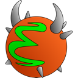
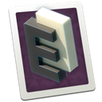
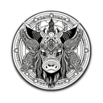
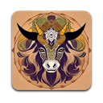

# Icons Gallery

This directory contains community-maintained icons for Emacs+.

## Usage

To use an icon, add it to your `~/.config/emacs-plus/build.yml`:

```yaml
icon: icon-name
```

For example:
```yaml
icon: dragon-plus
```

This works for both **formula** and **cask** installations:
- Formula: Icon is applied during `brew install emacs-plus@31 ...`
- Cask: Icon is applied during `brew install --cask emacs-plus@31`

To change icons after installation, update `build.yml` and reinstall:
```bash
brew reinstall emacs-plus@31        # formula
brew reinstall --cask emacs-plus@31 # cask
```

## macOS 26+ (Tahoe) Compliant Icons (2)

These icons include `Assets.car` for native macOS Tahoe support. They display
properly without the "icon jail" effect and react to system appearance changes.

**Note on pre-Tahoe compatibility:** Tahoe icons may contain multiple style variants
(light, dark, tinted, etc.) that only macOS 26+ can display. On older systems, the
fallback `.icns` file is used, which may not match the colorful preview shown here.
Check the "Pre-Tahoe" column to see if an icon has proper pre-Tahoe support.

| Light | Dark | Name | Pre-Tahoe | Author | Source |
|:-----:|:----:|------|:---------:|--------|--------|
|  |  | `dragon-plus` | ✓ | [d12frosted](https://github.com/d12frosted) | [Source](https://github.com/d12frosted/homebrew-emacs-plus) |
|  |  | `liquid-glass` | ✗ | [leaferiksen](https://github.com/leaferiksen) | [Source](https://github.com/leaferiksen/emacs-liquid-glass-icon) |

## All Icons (75)

Standard icons using `.icns` format. On macOS 26+, these may appear in "icon jail"
(displayed smaller within a rounded square container).

| Preview | Name | Author | Source |
|:-------:|------|--------|--------|
|  | `c9rgreen-sonoma` | [c9rgreen](https://github.com/c9rgreen) | [Source](https://github.com/c9rgreen/emacs-macos-icon) |
|  | `cacodemon` | [wildwestrom](https://github.com/wildwestrom) | [Source](https://gitlab.com/wildwestrom/emacs-doom-icon) |
|  | `dragon` | [willbchang](https://github.com/willbchang) | [Source](https://github.com/willbchang/emacs-dragon-icon) |
|  | `elrumo1` | [elrumo](https://github.com/elrumo) | [Source](https://github.com/d12frosted/homebrew-emacs-plus/issues/303#issuecomment-763928162) |
|  | `elrumo2` | [elrumo](https://github.com/elrumo) | [Source](https://github.com/d12frosted/homebrew-emacs-plus/issues/303#issuecomment-763928162) |
|  | `emacs-card-blue-deep` | [jasonm23](https://github.com/jasonm23) | [Source](https://github.com/emacsfodder/emacs-icons-project) |
|  | `emacs-card-british-racing-green` | [jasonm23](https://github.com/jasonm23) | [Source](https://github.com/emacsfodder/emacs-icons-project) |
|  | `emacs-card-carmine` | [jasonm23](https://github.com/jasonm23) | [Source](https://github.com/emacsfodder/emacs-icons-project) |
|  | `emacs-card-green` | [jasonm23](https://github.com/jasonm23) | [Source](https://github.com/emacsfodder/emacs-icons-project) |
|  | `EmacsIcon1` | [jasonm23](https://github.com/jasonm23) | [Source](https://github.com/emacsfodder/emacs-icons-project) |
|  | `EmacsIcon2` | [jasonm23](https://github.com/jasonm23) | [Source](https://github.com/emacsfodder/emacs-icons-project) |
|  | `EmacsIcon3` | [jasonm23](https://github.com/jasonm23) | [Source](https://github.com/emacsfodder/emacs-icons-project) |
|  | `EmacsIcon4` | [jasonm23](https://github.com/jasonm23) | [Source](https://github.com/emacsfodder/emacs-icons-project) |
|  | `EmacsIcon5` | [jasonm23](https://github.com/jasonm23) | [Source](https://github.com/emacsfodder/emacs-icons-project) |
|  | `EmacsIcon6` | [jasonm23](https://github.com/jasonm23) | [Source](https://github.com/emacsfodder/emacs-icons-project) |
|  | `EmacsIcon7` | [jasonm23](https://github.com/jasonm23) | [Source](https://github.com/emacsfodder/emacs-icons-project) |
|  | `EmacsIcon8` | [jasonm23](https://github.com/jasonm23) | [Source](https://github.com/emacsfodder/emacs-icons-project) |
|  | `EmacsIcon9` | [jasonm23](https://github.com/jasonm23) | [Source](https://github.com/emacsfodder/emacs-icons-project) |
|  | `gnu-head` | [aurium](https://github.com/aurium) | [Source](https://www.gnu.org/graphics/heckert_gnu.html) |
|  | `golden-yak` | [emacsfodder](https://github.com/emacsfodder) | [Source](https://github.com/emacsfodder/Infinite-Yak-Icons) |
|  | `infinity-yak-adacious` | [emacsfodder](https://github.com/emacsfodder) | [Source](https://github.com/emacsfodder/Infinite-Yak-Icons) |
|  | `infinity-yak-akadabra` | [emacsfodder](https://github.com/emacsfodder) | [Source](https://github.com/emacsfodder/Infinite-Yak-Icons) |
|  | `infinity-yak-alaka` | [emacsfodder](https://github.com/emacsfodder) | [Source](https://github.com/emacsfodder/Infinite-Yak-Icons) |
|  | `infinity-yak-amoto` | [emacsfodder](https://github.com/emacsfodder) | [Source](https://github.com/emacsfodder/Infinite-Yak-Icons) |
|  | `infinity-yak-amura` | [emacsfodder](https://github.com/emacsfodder) | [Source](https://github.com/emacsfodder/Infinite-Yak-Icons) |
|  | `infinity-yak-andwhite` | [emacsfodder](https://github.com/emacsfodder) | [Source](https://github.com/emacsfodder/Infinite-Yak-Icons) |
|  | `infinity-yak-astra` | [emacsfodder](https://github.com/emacsfodder) | [Source](https://github.com/emacsfodder/Infinite-Yak-Icons) |
|  | `infinity-yak-noir` | [emacsfodder](https://github.com/emacsfodder) | [Source](https://github.com/emacsfodder/Infinite-Yak-Icons) |
|  | `infinity-yak-onfire` | [emacsfodder](https://github.com/emacsfodder) | [Source](https://github.com/emacsfodder/Infinite-Yak-Icons) |
|  | `infinity-yak-onthewater` | [emacsfodder](https://github.com/emacsfodder) | [Source](https://github.com/emacsfodder/Infinite-Yak-Icons) |
|  | `infinity-yak-satori` | [emacsfodder](https://github.com/emacsfodder) | [Source](https://github.com/emacsfodder/Infinite-Yak-Icons) |
|  | `infinity-yak-shack` | [emacsfodder](https://github.com/emacsfodder) | [Source](https://github.com/emacsfodder/Infinite-Yak-Icons) |
|  | `infinity-yak-topia` | [emacsfodder](https://github.com/emacsfodder) | [Source](https://github.com/emacsfodder/Infinite-Yak-Icons) |
|  | `memeplex-slim` | [memeplex](https://github.com/memeplex) | [Source](https://github.com/d12frosted/homebrew-emacs-plus/issues/419#issuecomment-966735773) |
|  | `memeplex-wide` | [memeplex](https://github.com/memeplex) | [Source](https://github.com/d12frosted/homebrew-emacs-plus/issues/419#issuecomment-966735773) |
|  | `modern` | Unknown |  |
|  | `modern-alecive-flatwoken` | Alessandro Roncone | [Source](https://www.iconarchive.com/show/flatwoken-icons-by-alecive.html) |
|  | `modern-asingh4242` | Asingh4242 | [Source](https://imgur.com/YGxjLZw) |
|  | `modern-azhilin` | Andrew Zhilin | [Source](https://commons.wikimedia.org/wiki/File:Emacs-icon-48x48.png) |
|  | `modern-bananxan` | BananXan | [Source](https://www.deviantart.com/bananxan/art/Emacs-icon-207744728) |
|  | `modern-black-dragon` | Osike | [Source](https://www.cleanpng.com/png-spacemacs-computer-software-command-line-interface-3947037) |
|  | `modern-black-gnu-head` | Aha-Soft | [Source](https://www.iconfinder.com/iconsets/flat-round-system) |
|  | `modern-black-variant` | BlackVariant | [Source](https://www.deviantart.com/blackvariant) |
|  | `modern-bokehlicia-captiva` | Bokehlicia | [Source](https://www.iconarchive.com/show/captiva-icons-by-bokehlicia/emacs-icon.html) |
|  | `modern-cg433n` | [cg433n](https://github.com/cg433n) | [Source](https://github.com/cg433n/emacs-mac-icon) |
|  | `modern-doom` | Eccentric J | [Source](https://github.com/eccentric-j/doom-icon) |
|  | `modern-doom3` | Eccentric J | [Source](https://github.com/eccentric-j/doom-icon) |
|  | `modern-mzaplotnik` | Matjaz Zaplotnik | [Source](https://commons.wikimedia.org/wiki/File:Emacs-icon-48x48.svg) |
|  | `modern-nuvola` | David Vignoni | [Source](https://commons.wikimedia.org/wiki/File:Nuvola_apps_emacs_vector.svg) |
|  | `modern-orange` | [VentGrey](https://github.com/VentGrey) | [Source](https://github.com/PapirusDevelopmentTeam/papirus-icon-theme/issues/1742) |
|  | `modern-paper` | [snwh](https://github.com/snwh) | [Source](https://github.com/snwh/paper-icon-theme) |
|  | `modern-paper-icons` | [snwh](https://github.com/snwh) | [Source](https://github.com/snwh/paper-icon-theme) |
|  | `modern-papirus` | [PapirusDevelopmentTeam](https://github.com/PapirusDevelopmentTeam) | [Source](https://github.com/PapirusDevelopmentTeam/papirus-icon-theme) |
|  | `modern-pen` | [nanasess](https://github.com/nanasess) | [Source](https://github.com/nanasess/EmacsIconCollections) |
|  | `modern-pen-3d` | Unknown | [Source](https://download-mirror.savannah.gnu.org/releases/emacs/icons) |
|  | `modern-pen-black` | [csantosb](https://github.com/csantosb) | [Source](https://gitlab.com/csantosb) |
|  | `modern-pen-lds56` | lds56 | [Source](http://lds56.github.io/notes/emacs-icon-redesigned) |
|  | `modern-purple` | [NicolasPetton](https://github.com/NicolasPetton) | [Source](https://git.savannah.gnu.org/cgit/emacs.git/tree/etc/images/icons) |
|  | `modern-purple-flat` | Jeremiah Foster | [Source](https://icon-icons.com/icon/emacs/103962) |
|  | `modern-sexy-v1` | Emacs is Sexy | [Source](https://emacs.sexy) |
|  | `modern-sexy-v2` | Emacs is Sexy | [Source](https://emacs.sexy) |
|  | `modern-sjrmanning` | [sjrmanning](https://github.com/sjrmanning) | [Source](https://github.com/sjrmanning/emacs-icon) |
|  | `modern-vscode` | [vdegenne](https://github.com/vdegenne) | [Source](https://github.com/VSCodeEmacs/Emacs) |
|  | `modern-yellow` | Unknown | [Source](http://getdrawings.com/emacs-icon) |
|  | `nobu417-big-sur` | [nobu417](https://github.com/nobu417) | [Source](https://github.com/nobu417/emacs-icon-replacement-for-macos-big-sur) |
|  | `retro-emacs-logo` | Luis Fernandes | [Source](https://en.m.wikipedia.org/wiki/File:Emacs-logo.svg) |
|  | `retro-gnu-meditate-levitate` | Nevrax Design Team | [Source](https://www.gnu.org/graphics/meditate.en.html) |
|  | `retro-sink` | Erik Mugele | [Source](https://www.teuton.org/~ejm/emacsicon/) |
|  | `retro-sink-bw` | Unknown | [Source](https://www.teuton.org/~ejm/emacsicon/) |
|  | `savchenkovaleriy-big-sur` | [SavchenkoValeriy](https://github.com/SavchenkoValeriy) | [Source](https://github.com/SavchenkoValeriy/emacs-icons) |
|  | `savchenkovaleriy-big-sur-3d` | [SavchenkoValeriy](https://github.com/SavchenkoValeriy) | [Source](https://github.com/SavchenkoValeriy/emacs-icons) |
|  | `savchenkovaleriy-big-sur-curvy-3d` | [SavchenkoValeriy](https://github.com/SavchenkoValeriy) | [Source](https://github.com/SavchenkoValeriy/emacs-icons) |
|  | `skamacs` | [compufox](https://github.com/compufox) | [Source](https://github.com/compufox/skamacs-icon) |
|  | `spacemacs` | [nashamri](https://github.com/nashamri) | [Source](https://github.com/nashamri/spacemacs-logo) |
|  | `splash-screen-icon` | Unknown |  |

---

## Contributing

See the [community README](../README.md) for instructions on adding new icons.

### Requirements

Each icon must include:
- `icon.icns` - The icon file (required)
- `metadata.json` - Icon metadata (name, maintainer, homepage)
- `preview.png` - 128x128 preview image

#### Optional: macOS 26+ (Tahoe) Support

For icons designed for macOS Tahoe's liquid glass aesthetic, include:
- `icon.icon/` - Source Icon Composer bundle
- `Assets.car` - Compiled asset catalog for Tahoe

The script will automatically generate `preview-light.png` and `preview-dark.png`
from the `icon.icon` source using `ictool`.

On macOS 26+, the system prioritizes `Assets.car` over `.icns` files. If your icon includes
`Assets.car`, it will be used on Tahoe while the `.icns` provides fallback for older macOS versions.

**Metadata fields for Tahoe icons:**
- `tahoe_sha256` - SHA256 checksum of Assets.car (for verification)
- `tahoe_icon_name` - Icon name inside Assets.car (defaults to "Emacs" if not specified)

To compile `Assets.car` from an `.icon` bundle, use Apple's `actool`:
```bash
actool icon.icon --compile . --app-icon IconName --enable-on-demand-resources NO \
  --minimum-deployment-target 26.0 --platform macosx --output-partial-info-plist /dev/null
```

To regenerate previews and this README, run:
```bash
ruby scripts/generate-icon-previews.rb
```
