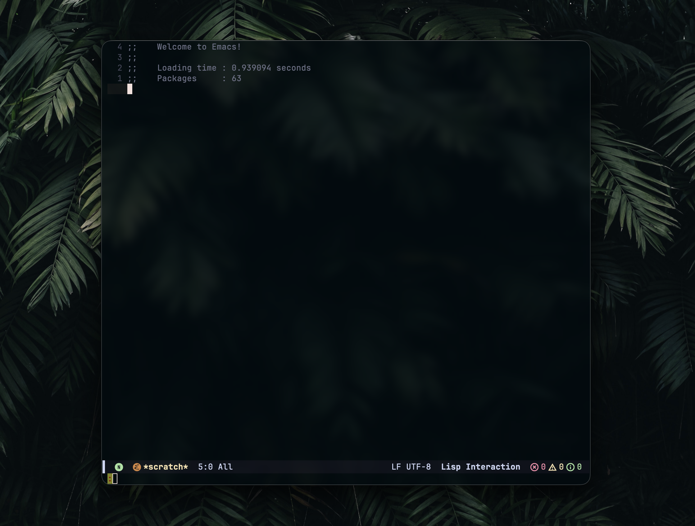

# frame-transparency

Adds configurable frame transparency and background blur support on macOS using CGS APIs

## Showcase

Transparency + Blurring (alpha 0.5, blur 20)


## Compatibility

- Emacs versions: 31

## Maintainer

aaratha

## Usage

Add to your `~/.config/emacs-plus/build.yml`:

```yaml
patches:
  - frame-transparency
```

Then rebuild Emacs:

```bash
brew reinstall emacs-plus@31
```

To use the new features, choose which elements should be rendered with transparency

``` emacs-lisp
;; None:
(set-frame-parameter nil 'ns-alpha-elements nil)

;; All:
(set-frame-parameter nil 'ns-alpha-elements '(ns-alpha-all))

;; Choose elements:
;; - Full list: ns-alpha-default (default face/background)
;;              ns-alpha-fringe (fringes + internal border clears)
;;              ns-alpha-box (boxed face outlines)
;;              ns-alpha-stipple (stipple mask background clears)
;;              ns-alpha-relief (3D relief/shadow lines)
;;              ns-alpha-glyphs (glyph background fills like hl-line/region)
(set-frame-parameter nil 'ns-alpha-elements
    '(ns-alpha-default ns-alpha-fringe ns-alpha-glyphs)) ;; e.g.
```

Then add alpha transparency and blur radius parameters in your config:

``` emacs-lisp
(set-frame-parameter nil 'alpha-background 0.5) 
(set-frame-parameter nil 'ns-background-blur 20)
```

Both features are opt-in via frame parameters (alpha-background and ns-background-blur).

Blur only works on Cocoa frames and is applied dynamically. You may notice that it doesn’t appear until the frame is updated, for example, when opening the command buffer.

## Patch Files

- `emacs-31.patch` - Patch for Emacs 31
